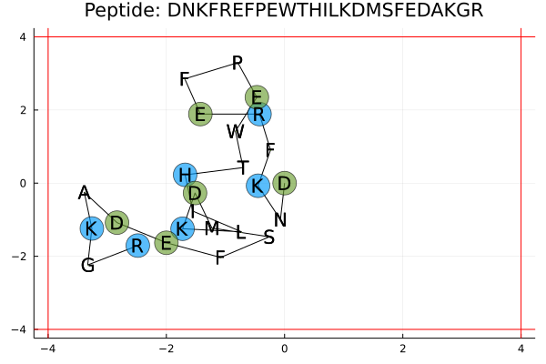

# PeptFold2D.jl

[Go to PeptFold2D_v2.jl](notebook/PeptFold2D_v2.jl)

**PeptFold2D** provides a simplified off-lattice model for peptide folding in 2D space. Using an off-lattice model allows to fully query the available geometric space.
- A peptide structure is generated based on an amino acid (AA) sequence and a (random) vector θ of bond angles. Starting from a specified coordinate (e.g. [0,0]), the bond angle in combination with a fixed bond length is sufficient to position an amino acid in relation to the previous amino acid.
- To optimize the position of the amino acids in the peptide based on this initial structure, their potential energy is evaluated as the sum of pairwise interactions with all other non-bonded amino acids. The potential energy function is defined by a coulomb electrostatic interaction term and a Lennard-Jones vanderwaals interaction term between non-bonded AAs.
- To constrain the simulation space, the potential energy function is fed to a loss function. This loss function adds a penalty for exceeding the limits of the simulation box. The size of the box is set by the user.
- A 2 step optimization (initial solution + simulated annealing) is applied to this structure to minimize its potential energy by optimizing the bond angles between the peptide AAs.

The user can play around with peptide sequence, length, charge and size of the simulation box. To optimize the structure, the user can set the number of iterations for the initial optimization and can adapt the parameters for simulated annealing (Tmin, Tmax, number of iterations kT and cooling rate r).

## Generating an initial peptide structure

A 2D peptide is represented as a string of AAs in which each AA is simplified as a single charged body. Peptides are created as a vector of charges using *create\_peptide()*. From this peptide, a structure is generated using *generate\_structure()*, taking a vector of charges and a vector of bond angles *θ* as arguments (bond length is an optional argument). A vector of n random bond angles can be generated using *θ\_generator()*. The function *structure\_to\_peptide()* is a wrapper for these functions taking only a peptide string as argument. To visualize the structure *plot\_structure()* is used.

```julia
peptide="DNKFREFPEWTHILKDMSFEDAKGR"

structure,coords=structure_from_peptide(peptide)
```


## Optimizing potential energy of the peptide structure within box constraint

Geometric optimization is minimizing a potential energy function. The potential energy function is the sum of 2 interaction terms over all non-bonded AAs. Electrostatic  interaction is calculated based on the coulomb law in *pot\_coulomb()*, while vanderwaals interaction is calculated based on Lennard-Jones interaction in *pot\_LJ()* as the sum of pairwise interactions. To constrain the optimization within a certain simulation box, *loss\_θ()* applies a penalty on top of the total potential energy for exceeding the box limits (box size is an optional argument).

A two step geometric optimization is applied. First, *random\_opt()* generates an initial solution from n random bond angle vectors.

```julia
opt_str_rand,obj_tracker_rand=random_opt(peptide,loss_θ,100000)
```


Next, *sim\_anneal\_opt()* takes the best solution into a simulated annealing method to further reduce the loss objective. This method generates \"good\" neighbors by selecting 1 residue and evaluating the objective for the full [-π,π] range of bond angles.

```julia
opt_str_good,obj_tracker_good=sim_anneal_opt(opt_str_rand, loss_θ,Tmin=0.001, Tmax=1.0, kT=100, r=0.95)
```



[](https://travis-ci.org/MichielStock/STMOZOO)[](https://coveralls.io/github/MichielStock/STMOZOO?branch=master)
